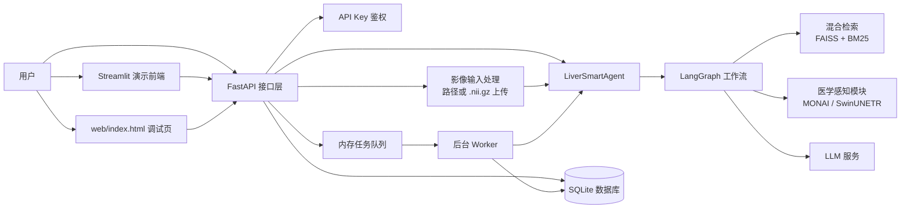
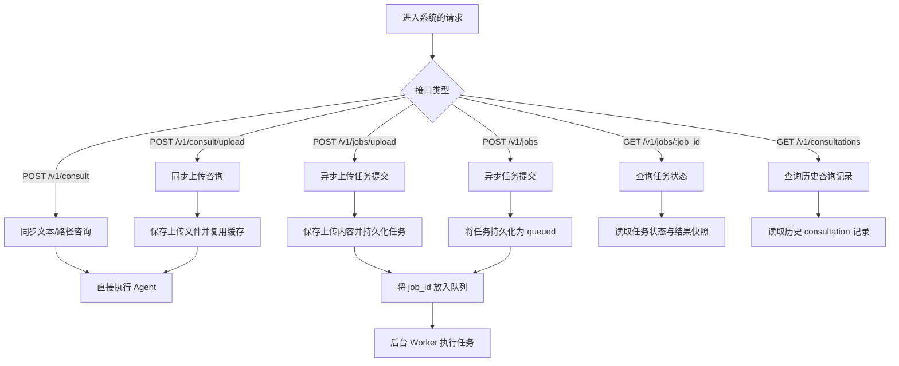
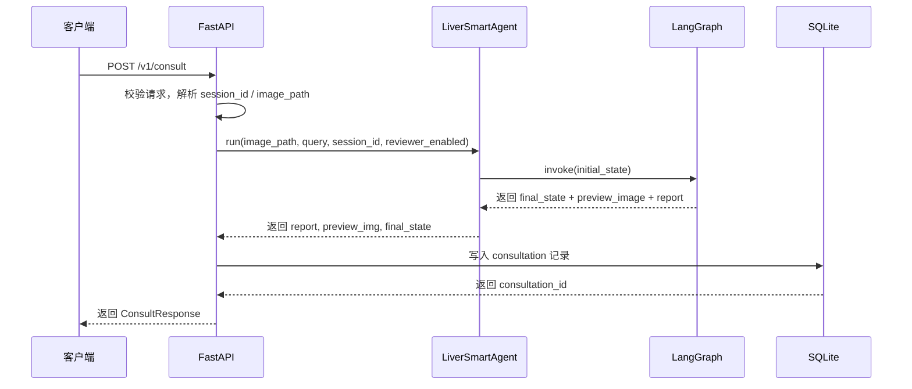
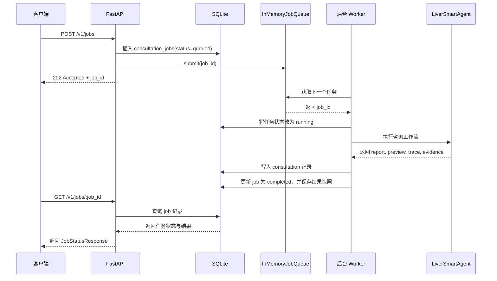
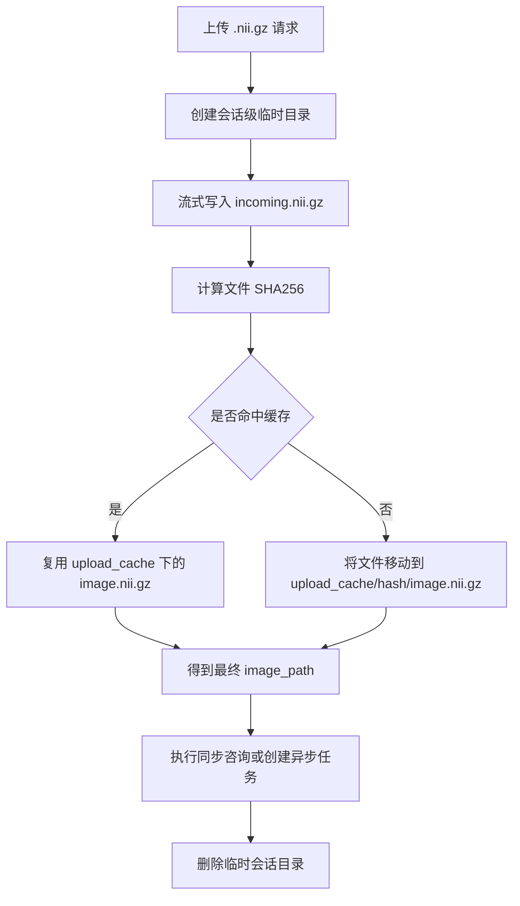
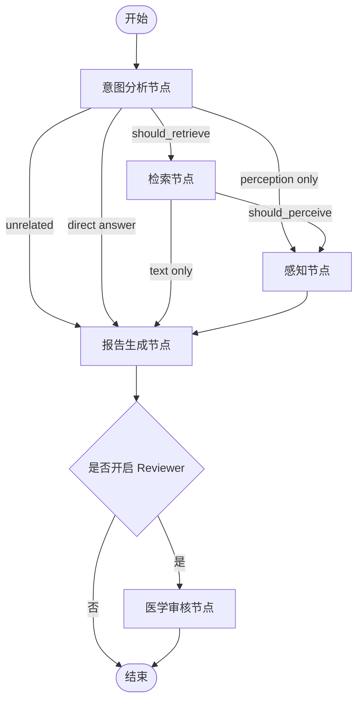
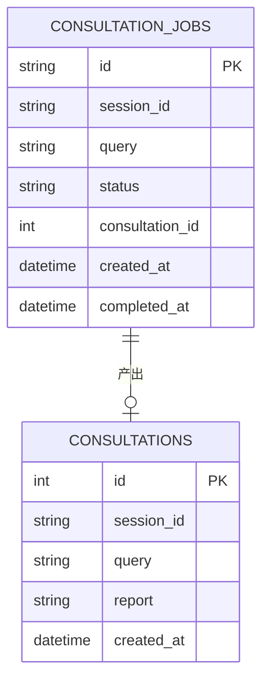

# Liver RAG 后端架构

这份文档用于说明项目当前的后端架构设计，采用 `Markdown + Mermaid` 方式绘制，可直接在支持 Mermaid 的 Markdown 预览器中显示。

## 1. 系统总览

## 2. 请求模式

## 3. 同步咨询链路

## 4. 异步任务链路

## 5. 上传与缓存链路

## 6. Agent 工作流

## 7. 持久化模型（仅展示核心字段）

