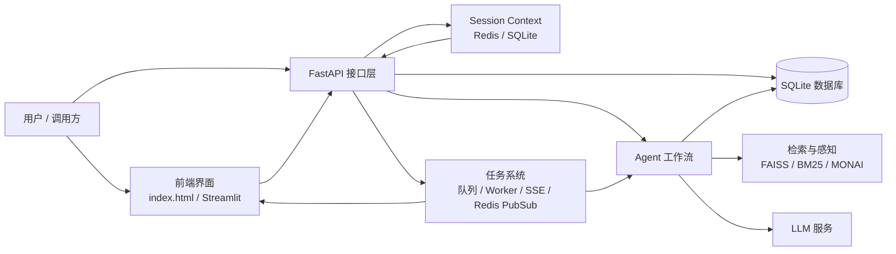
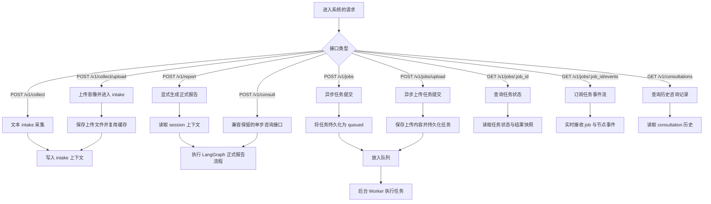
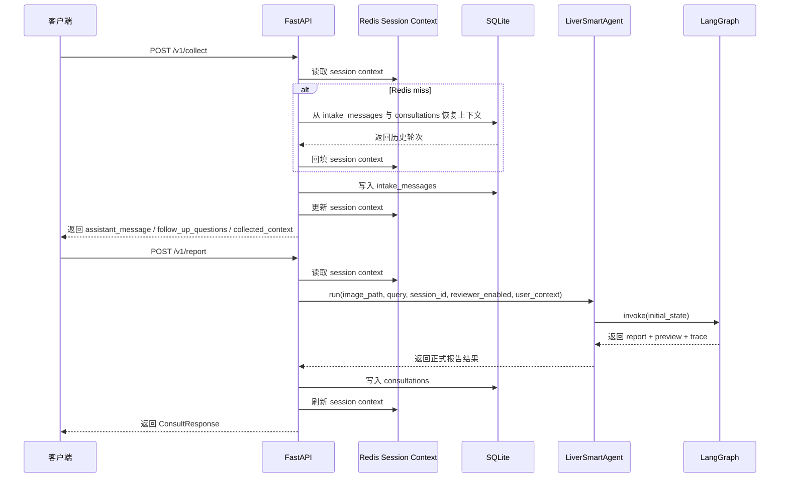
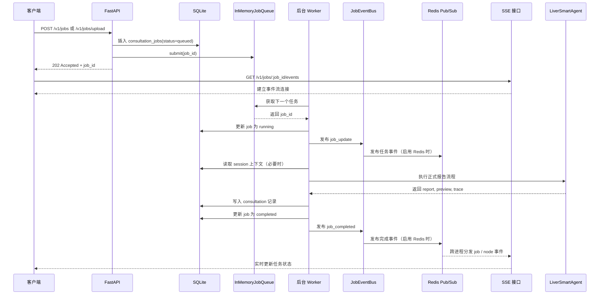
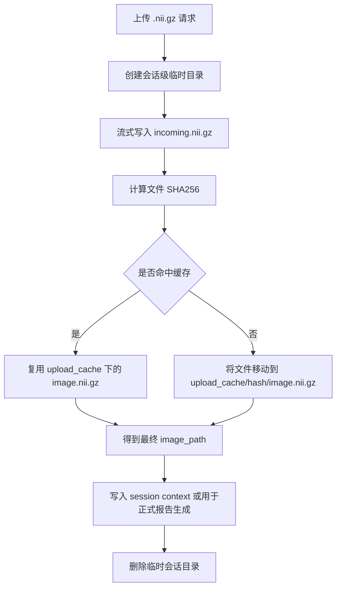
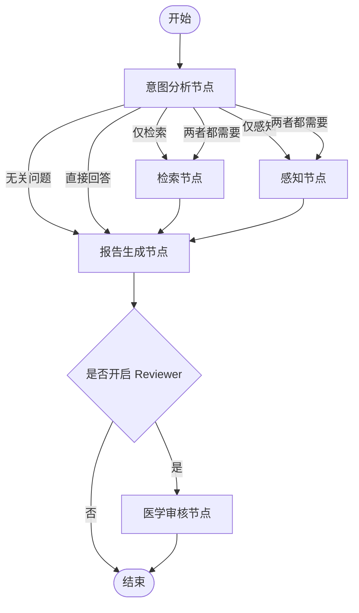
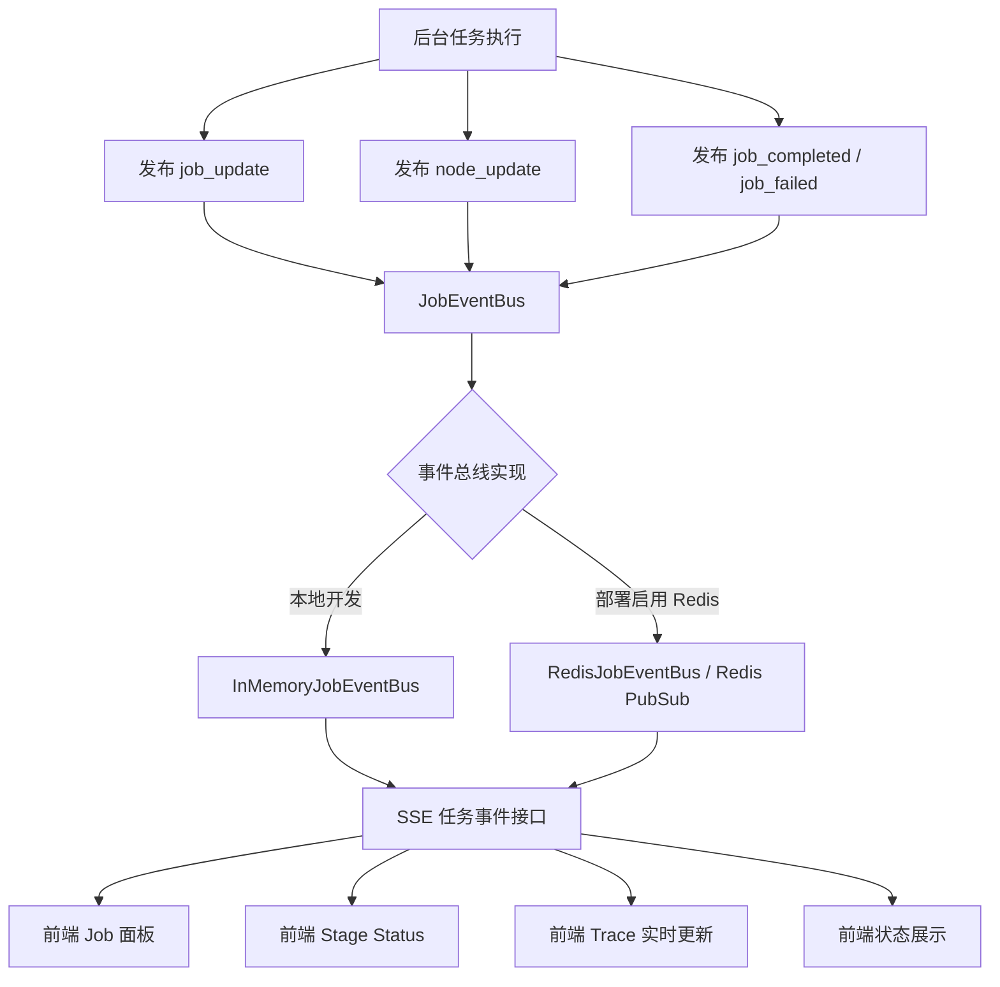
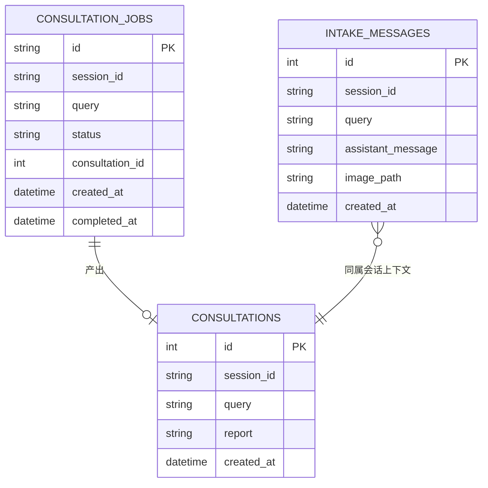

## 1. 系统总览

## 2. 请求模式

## 3. Intake 与报告链路

当前实现要点：

- `collect` 阶段负责记录用户输入、维护会话上下文，并给出下一步追问建议
- `report` 阶段才真正进入 LangGraph 正式报告流程
- `can_generate_report` 当前不再作为硬门槛，而是允许用户随时显式生成报告
- 会话上下文优先读 Redis，Redis miss 时可由数据库恢复

## 4. 异步任务链路

## 5. 上传与缓存链路

说明：

- 影像文件本体仍然落磁盘，不直接存入 Redis
- Redis 主要保存 session context、任务状态快照、检索缓存与事件分发
- 上传缓存采用基于 SHA256 的磁盘去重复用

## 6. Agent 工作流

说明：当前 LangGraph 工作流主要用于“正式报告生成”阶段。  
`collect / intake` 阶段不直接进入完整 graph，而是先基于会话上下文整理已知信息、生成追问建议，并由用户显式触发报告生成。

这一阶段的关键点是：

- 先由 `analyzer` 判断是否需要检索、是否需要感知
- 只有当两者都需要时，`retriever` 和 `perceptor` 才并行执行
- 二者完成后再汇总进入 `reporter`

## 7. SSE 事件流模型

当前系统中的 Redis 主要承担两类职责：

- 任务事件分发：支持 JobEventBus 在部署场景下通过 Redis pub/sub 跨进程推送事件
- 会话上下文缓存：缓存基于 `session_id` 的 intake / report 最近轮次，减少重复数据库读取

其中，任务事件通过 SSE 推送到前端；会话上下文主要服务于 intake 与正式报告生成流程。

当前前端可实时看到的内容包括：

- job 总体状态
- 当前正在执行的节点
- 各节点状态变化
- trace 流式更新

## 8. 持久化模型（仅展示核心字段）

## 9. 会话上下文恢复机制

当前会话上下文采用“Redis 缓存 + 数据库恢复”的方式：

- `collect` 阶段会将每轮 intake 写入 `intake_messages`，并同步更新 Redis session context
- `report` 阶段会读取同一 `session_id` 下的上下文，并将正式报告结果写入 `consultations`
- 当 Redis miss 或服务重启后，系统可基于 `intake_messages` 与 `consultations` 重建最近几轮上下文
- Redis 不再是 intake 历史的唯一来源，而是会话状态的加速层
