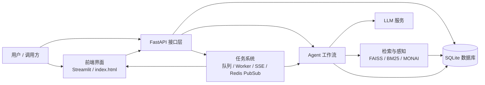
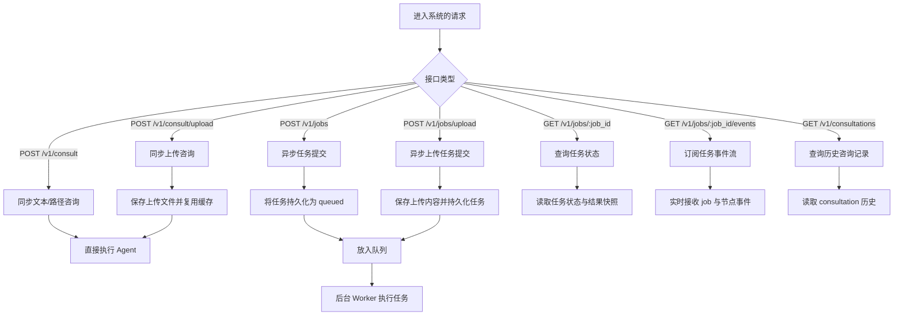
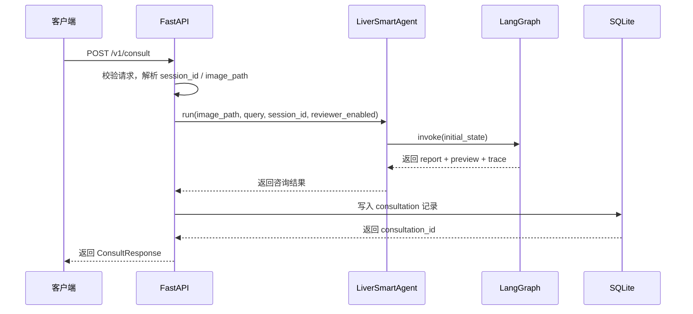
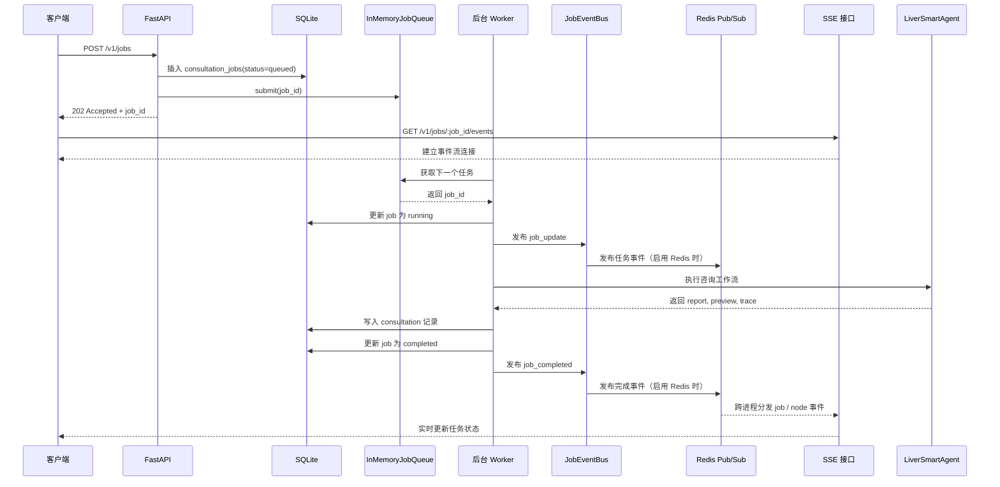
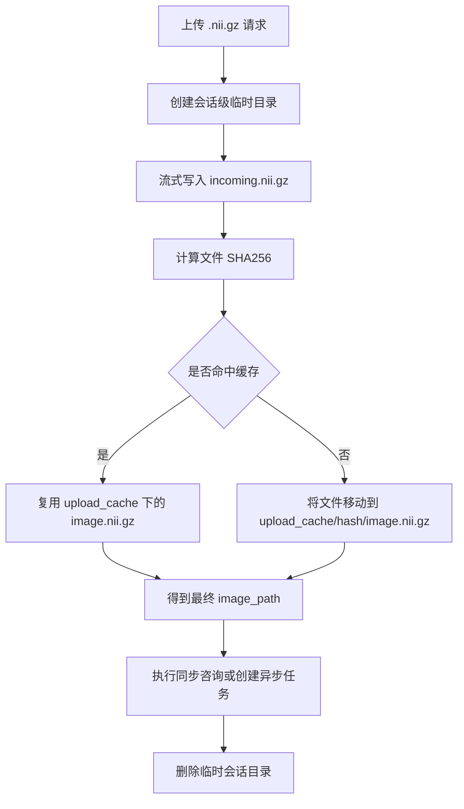
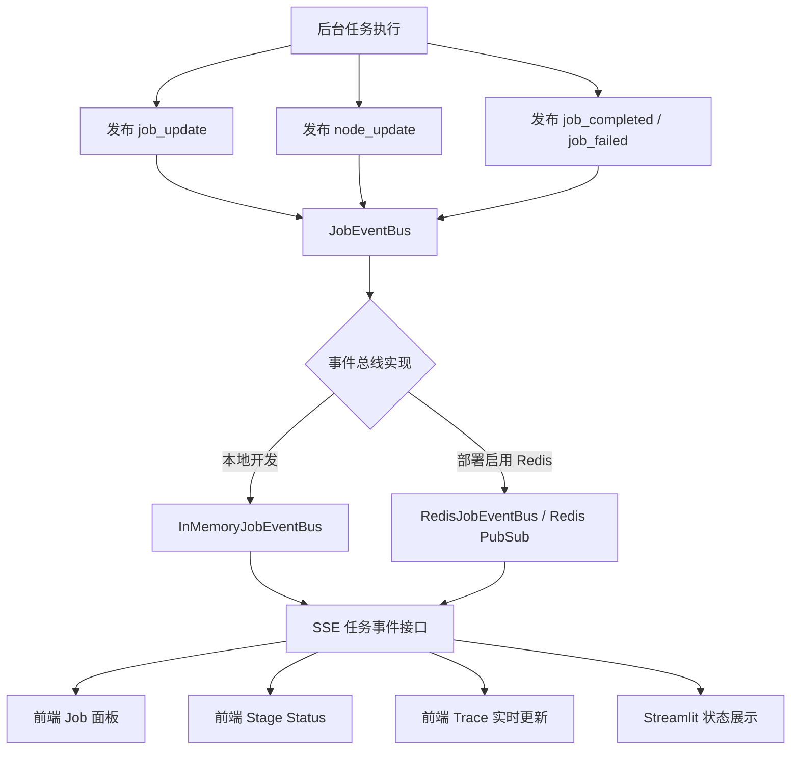
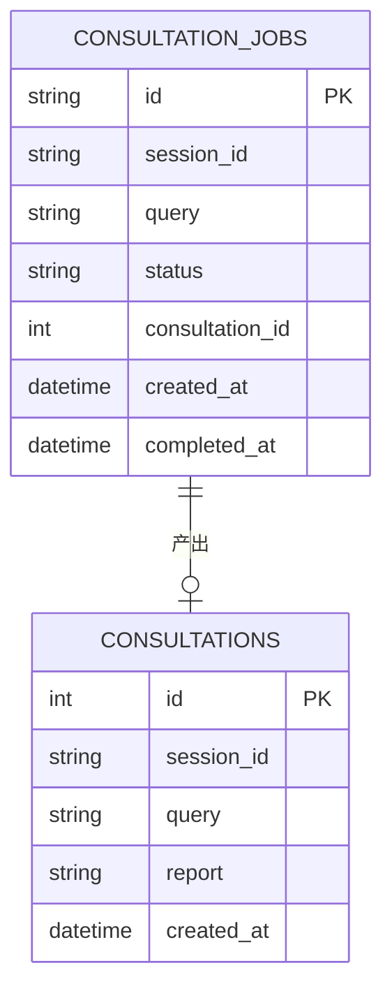

## 1. 系统总览

## 2. 请求模式

## 3. 同步咨询链路

## 4. 异步任务链路

## 5. 上传与缓存链路

## 6. Agent 工作流

这一步的关键点是：

- 先由 `analyzer` 判断是否需要检索、是否需要感知
- 只有当两者都需要时，`retriever` 和 `perceptor` 才并行执行
- 二者完成后再汇总进入 `reporter`

## 7. SSE 事件流模型

当前前端能实时看到的内容包括：

- job 总体状态
- 当前正在执行的节点
- 各节点状态面板
- trace 流式更新

当前任务事件流采用可切换的事件总线实现：

- 本地开发默认使用内存版 JobEventBus
- 配置 `LIVER_REDIS_URL` 后可切换为基于 Redis pub/sub 的事件分发
- SSE 接口统一消费事件并推送到前端，因此前端侧无需区分底层实现
- 该设计主要用于跨进程的 job / node 事件推送，不影响现有文件缓存与任务队列实现

## 8. 持久化模型（仅展示核心字段）

